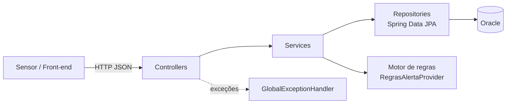
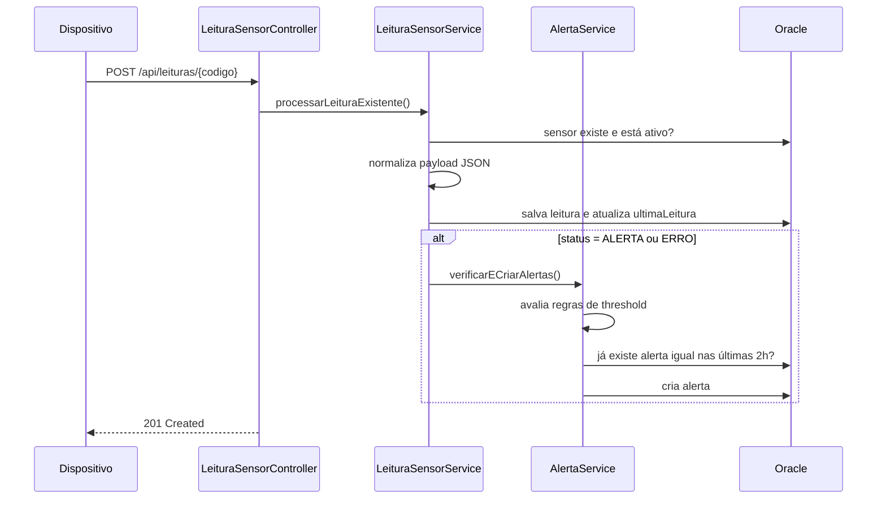
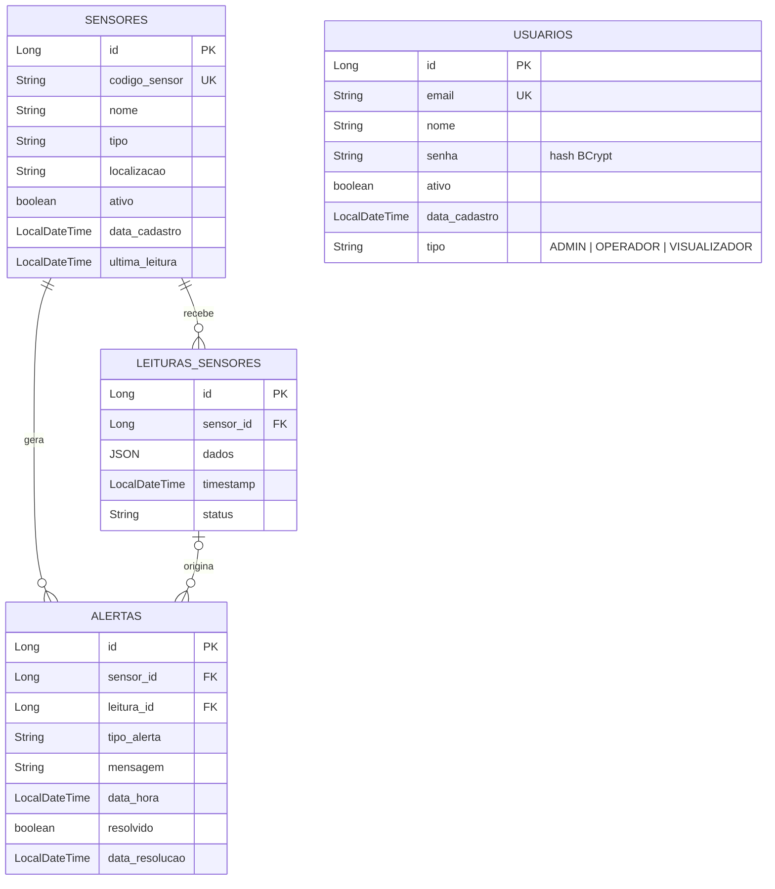

# Alerta360

[](https://github.com/DeyvidJesus/alerta360/actions/workflows/ci.yml)


[](LICENSE)

API REST para **monitoramento de sensores IoT**: cadastra dispositivos, recebe leituras com payload JSON livre, avalia regras de threshold, **gera alertas automaticamente** (com proteção contra duplicidade) e expõe métricas consolidadas para um dashboard.

> Cenário de uso: sensores de temperatura, umidade, CO₂ e gás em câmaras frias, galpões ou salas técnicas, que enviam leituras periódicas e precisam disparar alertas quando algo sai do normal ou quando o dispositivo para de reportar.

---

## Sumário

- [Destaques técnicos](#destaques-técnicos)
- [Stack](#stack)
- [Arquitetura](#arquitetura)
- [Como executar](#como-executar)
- [Documentação da API](#documentação-da-api)
- [Motor de alertas](#motor-de-alertas)
- [Modelo de dados](#modelo-de-dados)
- [Testes](#testes)
- [Estrutura do projeto](#estrutura-do-projeto)
- [Decisões técnicas e próximos passos](#decisões-técnicas-e-próximos-passos)

## Destaques técnicos

- **Payload de leitura schema-less**: cada sensor envia os campos que fizer sentido (`temperatura`, `co2`, `gas`...). Os dados são armazenados em uma coluna nativa `JSON` do Oracle e normalizados (arredondamento para 2 casas) na ingestão.
- **Motor de regras de alerta** desacoplado ([`RegraAlerta`](src/main/java/com/alerta360/utils/RegraAlerta.java) + [`RegrasAlertaProvider`](src/main/java/com/alerta360/utils/RegrasAlertaProvider.java)): cada regra define campo, operador, limite, tipo e mensagem com interpolação.
- **Throttling de alertas**: evita spam, com no máximo um alerta ativo do mesmo tipo por sensor a cada 2 horas.
- **Detecção de sensores offline**: sensores sem leitura há mais de 1 hora geram `SENSOR_OFFLINE`.
- **Estatísticas por período**: média, mínimo e máximo calculados dinamicamente para cada campo numérico do payload.
- **Tratamento de erros centralizado** com `@RestControllerAdvice` e corpo de erro padronizado (404, 409, 400, 401, 405).
- **Segurança de credenciais**: senhas com BCrypt; o hash nunca é serializado nas respostas.
- **Qualidade**: 41 testes (unitários com Mockito, de controller com MockMvc e de integração ponta a ponta com H2), CI no GitHub Actions e documentação OpenAPI/Swagger.
- **Ambiente reproduzível**: `docker compose up` sobe o Oracle e a API.

## Stack

| Camada | Tecnologias |
|---|---|
| Linguagem | Java 17 |
| Framework | Spring Boot 3.5 (Web, Data JPA, Security) |
| Persistência | Hibernate 6, Oracle Database 23ai (coluna `JSON` nativa) |
| Documentação | springdoc-openapi (Swagger UI) |
| Testes | JUnit 5, Mockito, AssertJ, MockMvc, H2 |
| Build / DevOps | Maven Wrapper, Docker, Docker Compose, GitHub Actions |
| Utilitários | Lombok, Jackson, BCrypt |

## Arquitetura

Arquitetura em camadas clássica do Spring, com as regras de negócio concentradas nos services:



Fluxo principal, da leitura ao alerta:



## Como executar

### Opção 1: Docker Compose (recomendado)

Requer apenas Docker. Sobe um Oracle 23ai Free e a API:

```bash
git clone https://github.com/DeyvidJesus/alerta360.git
cd alerta360
docker compose up --build
```

Na primeira execução o Oracle leva cerca de 1 a 2 minutos para ficar saudável. A API sobe em seguida e fica disponível em http://localhost:3000.

### Opção 2: Localmente com Maven

Requer **Java 17+** e um **Oracle 21c+** acessível (a coluna nativa `JSON` exige 21c ou superior). Para subir só o banco:

```bash
docker compose up -d oracle
```

Depois execute a aplicação:

```bash
./mvnw spring-boot:run        # Linux/macOS
mvnw.cmd spring-boot:run      # Windows
```

As tabelas são criadas automaticamente pelo Hibernate.

### Variáveis de ambiente

Todas têm valores padrão para desenvolvimento local (veja [`.env.example`](.env.example)):

| Variável | Padrão | Descrição |
|---|---|---|
| `DB_URL` | `jdbc:oracle:thin:@localhost:1521/FREEPDB1` | URL JDBC do Oracle |
| `DB_USERNAME` | `alerta360` | Usuário do banco |
| `DB_PASSWORD` | `DBalerta360` | Senha do banco (apenas para desenvolvimento) |
| `SERVER_PORT` | `3000` | Porta HTTP da API |
| `JPA_SHOW_SQL` | `false` | Loga as queries SQL geradas |

## Documentação da API

Com a aplicação rodando:

- **Swagger UI:** http://localhost:3000/swagger-ui.html
- **OpenAPI JSON:** http://localhost:3000/v3/api-docs

### Exemplo rápido

```bash
# 1. Cadastrar um sensor
curl -X POST http://localhost:3000/api/sensores \
  -H "Content-Type: application/json" \
  -d '{"codigoSensor": "TEMP001", "nome": "Câmara fria 1", "tipo": "temperatura", "localizacao": "Galpão A"}'

# 2. Enviar uma leitura fora do limite
curl -X POST http://localhost:3000/api/leituras/TEMP001 \
  -H "Content-Type: application/json" \
  -d '{"status": "ALERTA", "dadosMap": {"temperatura": 52.3, "umidade": 40}}'

# 3. Consultar os alertas gerados
curl http://localhost:3000/api/alertas/sensor/TEMP001

# 4. Saúde geral do sistema
curl http://localhost:3000/api/dashboard/health
```

### Endpoints

<details>
<summary><b>Sensores</b>: <code>/api/sensores</code></summary>

| Método | Rota | Descrição |
|---|---|---|
| `POST` | `/api/sensores` | Cadastra um sensor (criado como ativo) |
| `GET` | `/api/sensores` | Lista todos os sensores |
| `GET` | `/api/sensores/ativos` | Lista sensores ativos |
| `GET` | `/api/sensores/inativos?horasSemLeitura=24` | Sensores sem leitura no período |
| `GET` | `/api/sensores/tipo/{tipo}` | Filtra por tipo |
| `GET` | `/api/sensores/{codigo}` | Busca por código |
| `PUT` | `/api/sensores/{codigo}` | Atualiza nome, tipo e/ou localização |
| `PATCH` | `/api/sensores/{codigo}/status?ativo=false` | Ativa/desativa o sensor |
| `DELETE` | `/api/sensores/{codigo}` | Remove o sensor |
| `GET` | `/api/sensores/{codigo}/estatisticas` | Total de leituras e últimos dados |

</details>

<details>
<summary><b>Leituras</b>: <code>/api/leituras</code></summary>

| Método | Rota | Descrição |
|---|---|---|
| `POST` | `/api/leituras/{codigo}` | Registra uma leitura: `{"status": "OK\|ALERTA\|ERRO", "dadosMap": {...}}` |
| `GET` | `/api/leituras/{codigo}?limite=10` | Últimas N leituras |
| `GET` | `/api/leituras/{codigo}/ultima` | Leitura mais recente |
| `GET` | `/api/leituras/{codigo}/hoje` | Leituras do dia |
| `GET` | `/api/leituras/{codigo}/historico?ultimasHoras=24` | Leituras das últimas N horas |
| `GET` | `/api/leituras/{codigo}/periodo?inicio=...&fim=...` | Leituras em um intervalo (ISO-8601) |
| `GET` | `/api/leituras/{codigo}/estatisticas?inicio=...&fim=...` | Média, mínimo e máximo por campo |

</details>

<details>
<summary><b>Alertas</b>: <code>/api/alertas</code></summary>

| Método | Rota | Descrição |
|---|---|---|
| `GET` | `/api/alertas/ativos` | Alertas não resolvidos (mais recentes primeiro) |
| `GET` | `/api/alertas/sensor/{codigo}` | Histórico de alertas de um sensor |
| `GET` | `/api/alertas/tipo/{tipoAlerta}` | Alertas ativos de um tipo |
| `GET` | `/api/alertas/estatisticas/tipos` | Contagem de alertas ativos por tipo |
| `GET` | `/api/alertas/dashboard` | Total, distribuição por tipo e últimos 5 alertas |
| `POST` | `/api/alertas` | Cria um alerta manual: `{"sensor": {"id": 1}, "tipoAlerta": "...", "mensagem": "..."}` |
| `PATCH` | `/api/alertas/{id}/resolver` | Resolve um alerta (retorna 409 se já estiver resolvido) |
| `POST` | `/api/alertas/verificar-offline` | Gera `SENSOR_OFFLINE` para sensores sem leitura há mais de 1h |

</details>

<details>
<summary><b>Dashboard</b>: <code>/api/dashboard</code></summary>

| Método | Rota | Descrição |
|---|---|---|
| `GET` | `/api/dashboard/resumo` | Totais de sensores e alertas, distribuição por tipo |
| `GET` | `/api/dashboard/sensores/status` | Última leitura de cada sensor ativo |
| `GET` | `/api/dashboard/sensores/ativos` | Sensores ativos que já enviaram dados |
| `GET` | `/api/dashboard/sensores/inativos` | Sensores ativos que ainda não enviaram dados |
| `GET` | `/api/dashboard/monitoramento` | Resumo e status dos sensores em uma única chamada |
| `GET` | `/api/dashboard/health` | Status geral do sistema: `OK`, `ATENCAO` ou `CRITICO` |

O status de `/health` segue estas regras: **CRITICO** com mais de 5 alertas ativos; **ATENCAO** com ao menos 1 alerta ativo ou menos de 80% dos sensores ativos; **OK** nos demais casos.

</details>

<details>
<summary><b>Usuários</b>: <code>/api/usuarios</code></summary>

| Método | Rota | Descrição |
|---|---|---|
| `POST` | `/api/usuarios` | Cadastra um usuário (`ADMIN`, `OPERADOR` ou `VISUALIZADOR`) |
| `POST` | `/api/usuarios/login` | Valida as credenciais: `{"email": "...", "senha": "..."}` |
| `GET` | `/api/usuarios` | Lista usuários |
| `GET` | `/api/usuarios/{id}` | Busca por id |
| `GET` | `/api/usuarios/email/{email}` | Busca por e-mail |
| `GET` | `/api/usuarios/perfil/{id}` | Dados de perfil |
| `PUT` | `/api/usuarios/{id}` | Atualiza nome e/ou tipo |
| `PATCH` | `/api/usuarios/{id}/senha` | Altera a senha: `{"senhaAtual": "...", "novaSenha": "..."}` |
| `PATCH` | `/api/usuarios/{id}/status?ativo=false` | Ativa/desativa o usuário |

</details>

### Formato de erro

Todas as falhas retornam o mesmo formato:

```json
{
  "status": 404,
  "error": "Recurso não encontrado",
  "message": "Sensor não encontrado: XPTO",
  "path": "uri=/api/sensores/XPTO",
  "timestamp": "2025-06-10T23:28:20.123"
}
```

## Motor de alertas

O dispositivo envia a leitura com `status`. Quando o status é `ALERTA`, o backend avalia as regras abaixo contra os campos numéricos do payload para classificar o problema. Quando é `ERRO`, gera um alerta de falha de leitura.

| Tipo | Condição | Mensagem |
|---|---|---|
| `TEMPERATURA_ALTA` | `temperatura > 45` | Temperatura crítica: {valor}°C |
| `TEMPERATURA_BAIXA` | `temperatura < -10` | Temperatura muito baixa: {valor}°C |
| `UMIDADE_BAIXA` | `umidade < 20` | Umidade abaixo do limite: {valor}% |
| `CO2_ALTO` | `co2 > 1000` | Nível de CO2 elevado: {valor} ppm |
| `GAS_DETECTADO` | `gas > 1` | Presença de gás detectada: {valor} |
| `ERRO_LEITURA` | leitura com `status = ERRO` | Erro na leitura dos dados do sensor |
| `SENSOR_OFFLINE` | última leitura com mais de 1h | Sensor não envia dados há mais de 1 hora |

**Anti-spam:** um novo alerta só é criado se não houver outro **do mesmo tipo, para o mesmo sensor, não resolvido e criado nas últimas 2 horas**.

Para adicionar uma regra, basta incluí-la em [`RegrasAlertaProvider`](src/main/java/com/alerta360/utils/RegrasAlertaProvider.java). Os operadores suportados são `>`, `<`, `>=`, `<=` e `==`.

```java
new RegraAlerta("pressao", 1050, ">", "PRESSAO_ALTA", "Pressão elevada: {valor} hPa")
```

## Modelo de dados



## Testes

```bash
./mvnw test
```

Os testes **não precisam de Oracle**: o perfil `test` usa H2 em memória.

| Suíte | Tipo | O que valida |
|---|---|---|
| `RegraAlertaTest` | Unitário | Todos os operadores e a interpolação de mensagens |
| `AlertaServiceTest` | Unitário (Mockito) | Geração de alertas, thresholds reais, throttling, offline e resolução |
| `LeituraSensorServiceTest` | Unitário (Mockito) | Normalização do payload, sensor inativo/inexistente, disparo de alertas |
| `SensorServiceTest` / `UsuarioServiceTest` | Unitário (Mockito) | Duplicidade, atualização parcial, BCrypt, login de usuário inativo |
| `SensorControllerTest` / `UsuarioControllerTest` | Web (MockMvc) | Status HTTP, formato de erro e ausência da senha no JSON |
| `FluxoMonitoramentoIntegrationTest` | Integração | Fluxo completo sensor → leitura → alerta → dashboard, e OpenAPI |

O pipeline de [CI](.github/workflows/ci.yml) executa `./mvnw verify` a cada push e pull request.

## Estrutura do projeto

```
src/main/java/com/alerta360
├── config/        # Spring Security, BCrypt e OpenAPI
├── controller/    # Endpoints REST
├── service/       # Regras de negócio
├── repository/    # Spring Data JPA (queries derivadas e JPQL)
├── model/         # Entidades JPA
├── exception/     # Exceções de domínio + GlobalExceptionHandler
└── utils/         # Motor de regras de alerta
src/test/java/com/alerta360
├── controller/    # Testes web (MockMvc)
├── service/       # Testes unitários (Mockito)
├── utils/
└── FluxoMonitoramentoIntegrationTest.java
```

## Decisões técnicas e próximos passos

**Decisões**

- **Coluna JSON em vez de colunas fixas por métrica:** permite sensores heterogêneos sem migrações de schema a cada novo tipo de dispositivo. O custo é que as agregações são feitas na aplicação.
- **Classificação no backend:** o dispositivo apenas sinaliza `ALERTA`, e o backend decide o tipo e a mensagem. Com isso, os limites podem mudar sem atualizar firmware.
- **Throttling por tipo e sensor:** um sensor oscilando em torno do limite não gera dezenas de alertas idênticos.

**Limitações conhecidas e roadmap**

- [ ] Autenticação stateless com JWT e autorização por perfil (`ADMIN`/`OPERADOR`/`VISUALIZADOR`). Hoje o login valida as credenciais, mas as rotas estão abertas.
- [ ] DTOs de entrada e saída com Bean Validation, em vez de expor as entidades JPA.
- [ ] Verificação de sensores offline agendada com `@Scheduled`, em vez de acionada por endpoint.
- [ ] Regras de alerta persistidas e configuráveis via API.
- [ ] Migrações versionadas com Flyway, em vez de `ddl-auto=update`.
- [ ] Notificações de alerta (e-mail/webhook) e atualização em tempo real via WebSocket.

## Autor

Desenvolvido por **[DeyvidJesus](https://github.com/DeyvidJesus)**.

Licenciado sob a [MIT License](LICENSE).
